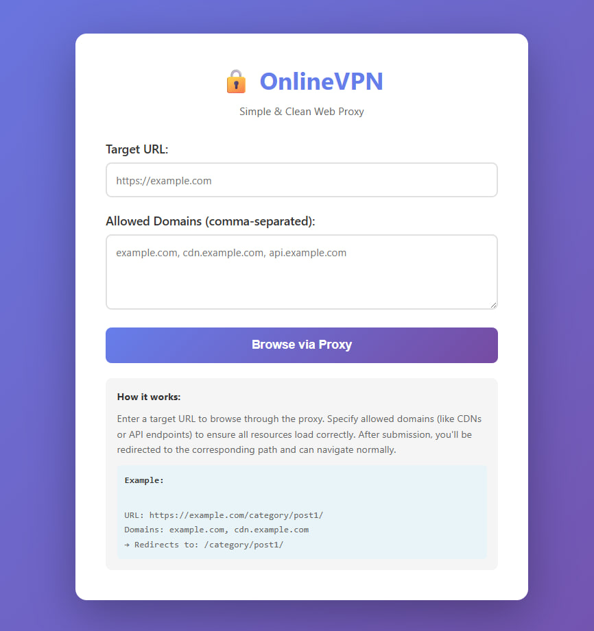

# Online VPN

> A clean, simple, and powerful web-based proxy platform designed in Python (Flask). Browse any website through the proxy with seamless navigation and support for both traditional and Single Page Applications (SPAs/PWAs).

A modern Python-based web proxy service for secure, flexible, and privacy-focused browsing. This project uses Flask and Requests to proxy web traffic, rewrite URLs, and provide SSRF protection, CORS support, and easy deployment via Docker and Nginx.




## Features

- 🔒 **Simple & Clean**: Single domain, GET-based routing with query parameters
- 🌐 **Smart URL Replacement**: Only proxies specified domains, leaving others untouched
- 🚀 **Easy Deployment**: Docker and docker-compose ready
- 🔄 **Seamless Navigation**: Session-based domain tracking for natural browsing
- 📱 **SPA/PWA Support**: Works with React, Vue, Angular, and other modern frameworks
- ⚡ **Efficient Streaming**: Binary content streamed without memory overhead
- 🛡️ **SSRF Protection**: Built-in security against internal network access

## Quick Start with Docker

### Prerequisites

- Docker Engine (version 20.10+)
- Docker Compose (version 2.0+)
- Two domain names pointing to your server

### Deployment

1. **Clone the repository**
   ```bash
   git clone https://github.com/BaseMax/OnlineVPN.git
   cd OnlineVPN
   ```

2. **Configure your domains**
   
   Edit `nginx/conf.d/vpn-app-1.conf` and `nginx/conf.d/vpn-app-2.conf` to replace `domain1.example.com` and `domain2.example.com` with your actual domains.

3. **Start the services**
   ```bash
   docker-compose up -d
   ```

4. **Access the application**
   - Instance 1: `http://localhost:8080`
   - Instance 2: `http://localhost:8081`
   - Via Domain 1: `http://your-domain1.com`
   - Via Domain 2: `http://your-domain2.com`

## Architecture

The deployment consists of:

- **2 Application Instances**: Running on ports 8080 and 8081
- **Nginx Reverse Proxy**: Forwarding 2 domains to the respective application instances on port 80 (HTTP) and 443 (HTTPS)
- **Docker Network**: All services communicate through a bridge network

```
Internet
   ↓
Nginx (Port 80/443)
   ├─→ domain1.example.com → vpn-app-1 (Port 8080)
   └─→ domain2.example.com → vpn-app-2 (Port 8081)
```

## How It Works

### Simple GET-based Routing

Access any website through the proxy using clean URLs:

```
https://proxy.maxbase.ir/proxy?url=https://example.com&domains=example.com,cdn.example.com
```

### Smart Domain Proxying

- **Specified domains only**: Only URLs matching your domain list are proxied
- **Session persistence**: Domains are remembered as you browse
- **Automatic navigation**: Links within proxied pages work seamlessly
- **External links preserved**: Non-proxied domains remain unchanged

### Usage Examples

**Basic usage (home page):**
1. Visit `https://proxy.maxbase.ir/`
2. Enter target URL: `https://example.com`
3. (Optional) Add additional domains: `cdn.example.com, api.example.com`
4. Click "Browse via Proxy"

**Direct URL access:**
```
https://proxy.maxbase.ir/proxy?url=https://news.ycombinator.com&domains=news.ycombinator.com
```

**Multi-domain browsing:**
```
https://proxy.maxbase.ir/proxy?url=https://github.com&domains=github.com,github.githubassets.com,avatars.githubusercontent.com
```

## Configuration

### SSL Certificate Verification

By default, SSL certificate verification is **disabled** to allow proxying sites with SSL issues or self-signed certificates. This is necessary for some sites but may expose you to security risks.

To enable SSL certificate verification, set the `SSL_VERIFY` environment variable:

```bash
# Enable SSL verification
export SSL_VERIFY=true
python app.py
```

Or with Docker:

```bash
docker run -e SSL_VERIFY=true ...
```

**Note:** When SSL verification is disabled, a warning message will be displayed in the logs.

## Documentation

For detailed deployment instructions, configuration options, and troubleshooting, see [DEPLOYMENT.md](DEPLOYMENT.md).

## Docker Services

- `vpn-app-1`: First application instance (port 8080)
- `vpn-app-2`: Second application instance (port 8081)
- `nginx`: Reverse proxy for domain forwarding (ports 80, 443)

## Configuration

The application uses a centralized configuration file (`config.py`):

```python
# Single domain configuration
PROXY_DOMAIN = "proxy.maxbase.ir"

# Request timeout in seconds
REQUEST_TIMEOUT = 30

# Content types to process for URL replacement
PROCESSABLE_CONTENT_TYPES = ['text/', 'application/javascript', 'application/json', 'application/xml']

# SSL verification (set to True to enable)
SSL_VERIFY = False
```

**To change the proxy domain:**
1. Edit `config.py`
2. Update the `PROXY_DOMAIN` value
3. Restart the application

## Development

To run the application locally without Docker:

```bash
# Install dependencies
pip install -r requirements.txt

# Run the application
python app.py
```

The application will be available at `http://localhost:5000`.

## Contributing

Contributions are welcome! Please feel free to submit a Pull Request.

## License

This project is licensed under the GPL-3.0 License. See the [LICENSE](LICENSE) file for details.

Copyright 2025, Seyyed Ali Mohammadiyeh (Max Base)
